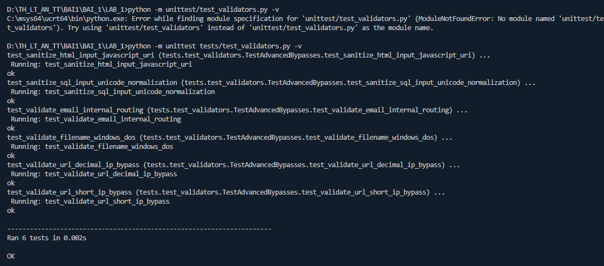
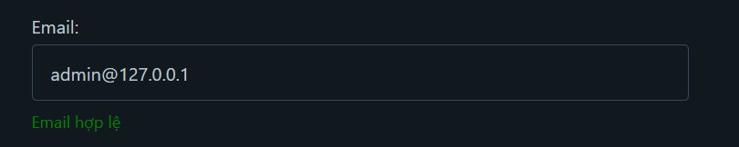
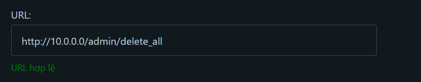
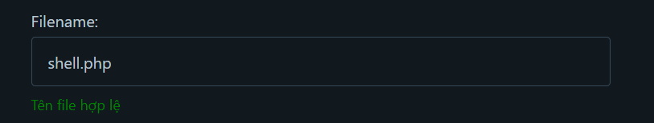
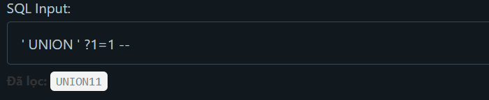

 test_validators đã thử 
 Lỗi phần kiểm tra tên miền trong Regex hiện tại đang cho phép chữ, số và dấu chấm Vì thế, một dải IP như 192.168.0.1 vẫn hoàn toàn khớp và vượt qua được thuật toán này . 
 Lỗi này do phần mã chỉ phân tích và lọc một số đầu vào và blacklist một số ip private/localhost dẫn đến một số ip vẫn còn sử dụng để py pass được 
 Lỗi thuật toán hiện tại chỉ chặn các ký tự lùi thư mục (Path Traversal) nhưng hoàn toàn bỏ qua việc kiểm tra đuôi mở rộng của tệp 
 Lỗi thuật toán đang sử dụng cơ chế danh sách đen (Blacklist) kết hợp biểu thức chính quy (Regex) để xóa các ký tự đặc biệt như dấu nháy đơn, dấu gạch ngang và khoảng trắng.
