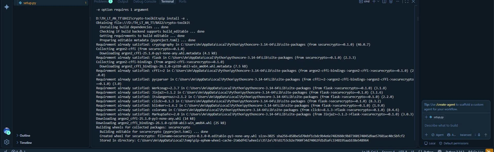
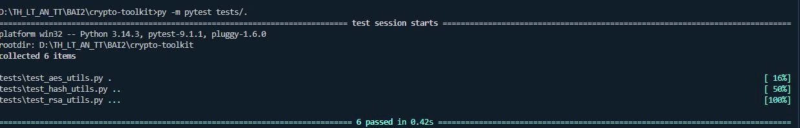
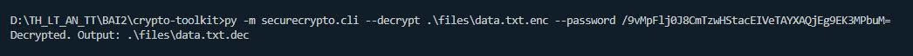
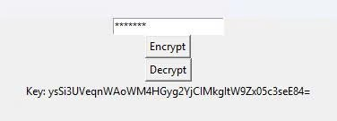
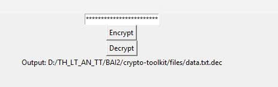
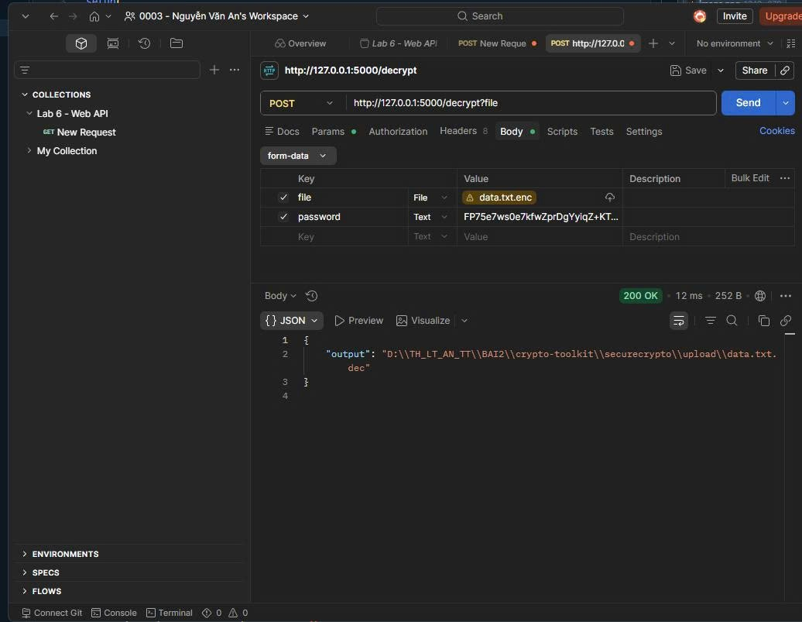
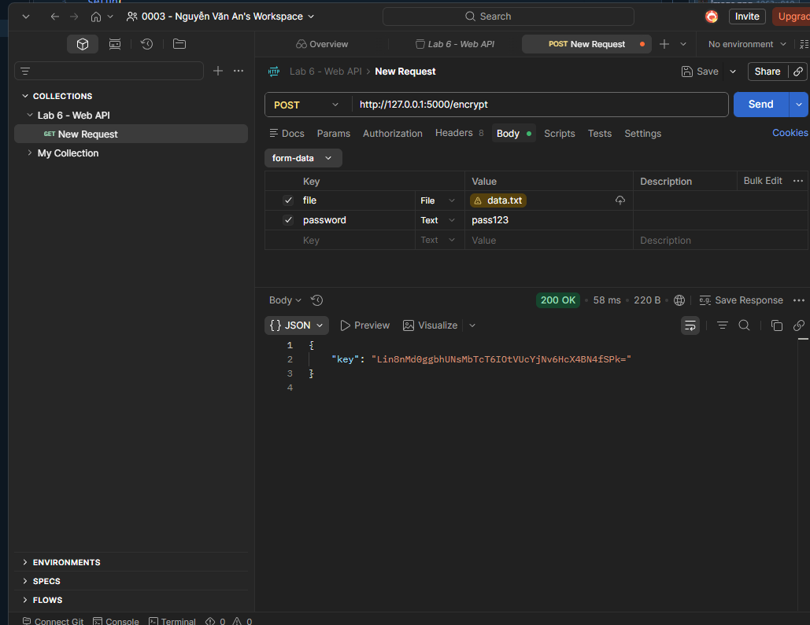

# LAB 1 - CryptoToolkit (2.2 Thực hành: CryptoToolkit)

Thư viện mật mã Python gồm mã hóa/giải mã file bằng AES-256-GCM, ký số/xác thực bằng RSA, và băm mật khẩu an toàn bằng Argon2. Cung cấp 3 giao diện sử dụng: CLI, GUI (Tkinter) và Web API (Flask).

## Cấu trúc

```
LAB_1/
├── files/data.txt
├── securecrypto/
│   ├── __init__.py
│   ├── aes_utils.py       # AES-256-GCM + PBKDF2HMAC key derivation
│   ├── hash_utils.py      # Argon2 password hashing
│   ├── rsa_utils.py       # RSA keypair, sign, verify
│   ├── cli.py             # CLI interface
│   ├── api.py             # Flask REST API
│   └── app_gui.py         # Tkinter GUI
├── tests/                 # pytest unit tests
├── requirements.txt
└── setup.py
```

## Cài đặt và chạy

```bash
pip install -e .
pytest tests/
```

## Ghi chú lỗi logic phát hiện trong quá trình thực hành

Hàm `decrypt_file_aes(encrypted_file, key_base64)` yêu cầu tham số thứ 2 là **key base64** (chuỗi trả về sau khi encrypt), nhưng ở `cli.py`, `app_gui.py`, `api.py`, biến này lại được đặt tên là `password`. Vì vậy khi giải mã, phải nhập **chuỗi Key base64 nhận được lúc mã hóa**, không phải mật khẩu plaintext ban đầu — nếu không sẽ báo lỗi `InvalidTag`.

## Minh chứng thực hiện


Cài package `securecrypto` ở chế độ editable, cài kèm cryptography, argon2-cffi, flask.


`pytest tests/` — 6/6 test pass (AES encrypt/decrypt, Argon2 hash/verify, RSA sign/verify).


`securecrypto-cli --decrypt` giải mã thành công file `.enc`, xuất ra `data.txt.dec`.


Chạy GUI Tkinter, bấm Encrypt, nhận về Key base64.


Dán Key vừa nhận vào ô mật khẩu, bấm Decrypt, output đúng file `data.txt.dec`.


Gọi POST `/decrypt` (form-data: `file`, `password`=key) — trả về `200 OK` kèm đường dẫn file đã giải mã.


Gọi POST `/encrypt` (form-data: `file`, `password`) — trả về `200 OK` kèm Key base64.
