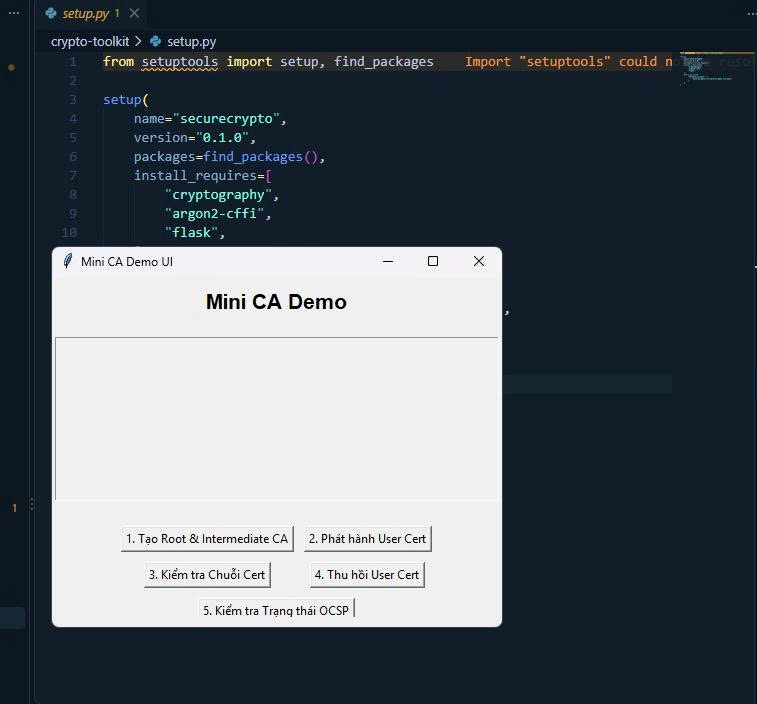
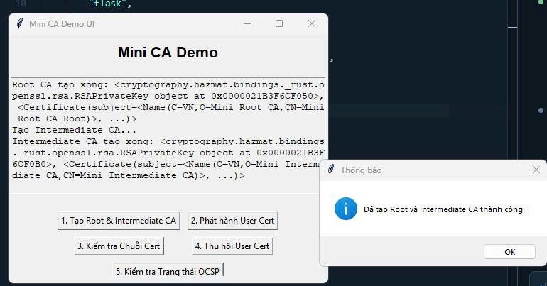
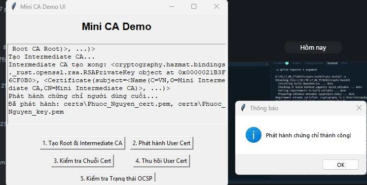
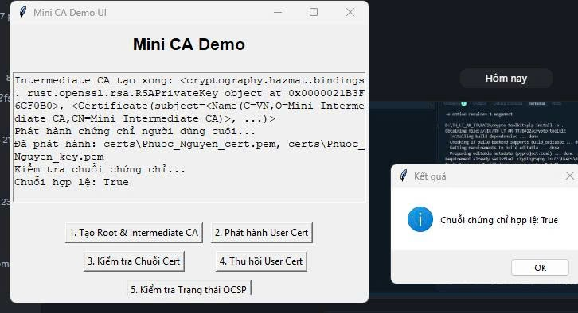
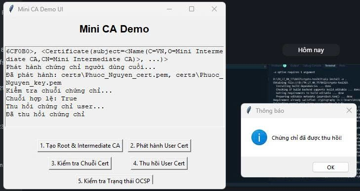
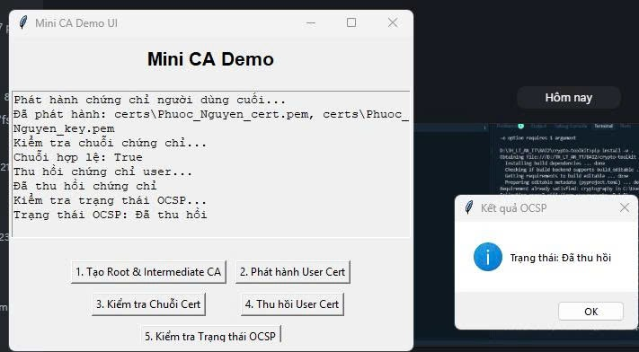

# LAB 2 - Mini Certificate Authority (2.4 Thực hành: Certificate Authority)

Mô phỏng hệ thống PKI đơn giản: tạo Root CA, Intermediate CA, phát hành chứng chỉ end-entity theo chuẩn X.509, xác thực chuỗi chứng chỉ (chain of trust), thu hồi chứng chỉ (CRL) và kiểm tra trạng thái thu hồi (giả lập OCSP).

## Cấu trúc

```
LAB_2/
├── ca_utils.py       # generate_key, create_root_ca, create_intermediate_ca,
│                      # issue_certificate, verify_certificate_chain
├── revoke_utils.py   # create_empty_crl, revoke_certificate, check_revocation_status
├── demo.py            # Kịch bản demo chạy bằng CLI, in log ra console
├── demo_ui.py          # Giao diện Tkinter demo trực quan (5 bước)
└── requirements.txt
```

## Cài đặt và chạy

```bash
pip install -r requirements.txt
python demo.py        # chạy toàn bộ quy trình qua console
python demo_ui.py      # chạy giao diện GUI, bấm lần lượt các nút 1 -> 5
```

## Quy trình PKI được mô phỏng

1. **Tạo Root CA** — tự ký, `BasicConstraints(ca=True, path_length=1)`, hiệu lực 10 năm.
2. **Tạo Intermediate CA** — được Root CA ký, `path_length=0` (không cấp CA con), hiệu lực 5 năm.
3. **Phát hành chứng chỉ end-entity** — do Intermediate CA ký, `ca=False`, hiệu lực 1 năm.
4. **Xác thực chuỗi chứng chỉ** — duyệt ngược chain (Intermediate → Root), verify chữ ký từng bước bằng `padding.PKCS1v15()` + SHA-256.
5. **Thu hồi chứng chỉ** — thêm serial number vào CRL (Certificate Revocation List), ký lại CRL bằng khóa Intermediate CA.
6. **Kiểm tra trạng thái OCSP** — dò serial number trong CRL để xác định Revoked/Valid.

## Kết quả chạy `demo.py`

```
Tạo Root CA...
Tạo Intermediate CA...
Phát hành chứng chỉ người dùng cuối...
Đã phát hành: certs\Phuoc_Nguyen_cert.pem, certs\Phuoc_Nguyen_key.pem
Kiểm tra chuỗi chứng chỉ...
Chuỗi hợp lệ: True
Thu hồi chứng chỉ user1...
Đã thu hồi
Kiểm tra trạng thái OCSP của Phuoc_Nguyen_cert.pem...
Trạng thái: Revoked
```

Thư mục `certs/` (sinh ra khi chạy, không commit vào git — xem `.gitignore`) chứa các file `.pem`: `root_ca_cert.pem`, `root_ca_key.pem`, `intermediate_cert.pem`, `intermediate_key.pem`, cert/key của end-entity, và `ca_crl.pem`.

## Minh chứng thực hiện


Giao diện Tkinter với 5 nút thao tác tương ứng các bước trong quy trình PKI.


Tạo thành công cặp khóa/chứng chỉ Root CA và Intermediate CA (ký bởi Root CA).


Intermediate CA phát hành chứng chỉ end-entity cho `Phuoc_Nguyen`, lưu ra `certs/Phuoc_Nguyen_cert.pem`.


`verify_certificate_chain` xác thực chữ ký từ User Cert → Intermediate → Root: kết quả `Chuỗi hợp lệ: True`.


`revoke_certificate` thêm serial number của chứng chỉ vào CRL, ký lại bằng khóa Intermediate CA.


`check_revocation_status` dò CRL, xác nhận chứng chỉ đã bị thu hồi: `Trạng thái: Đã thu hồi`.
