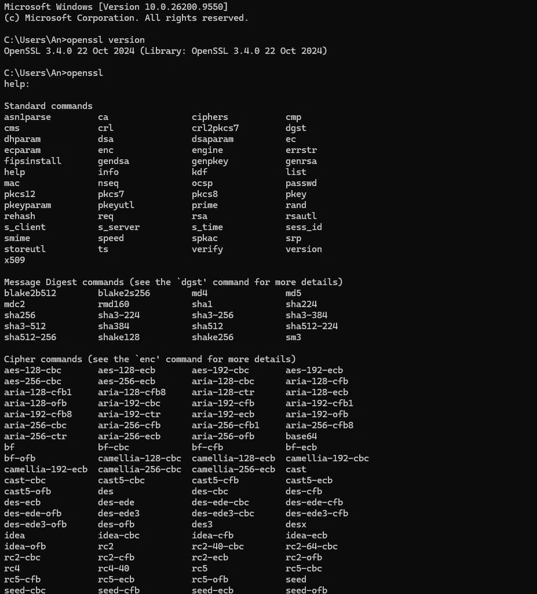
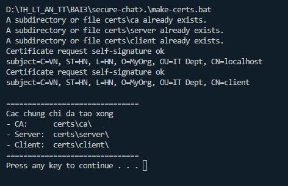
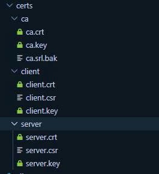
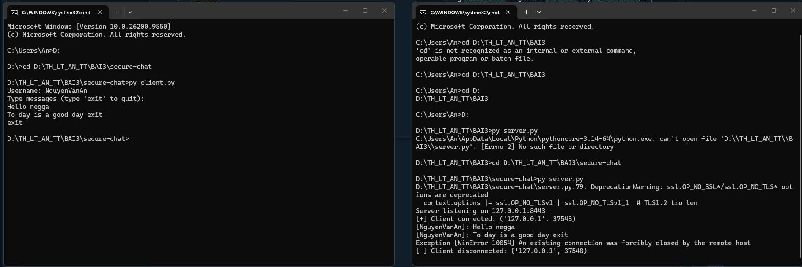
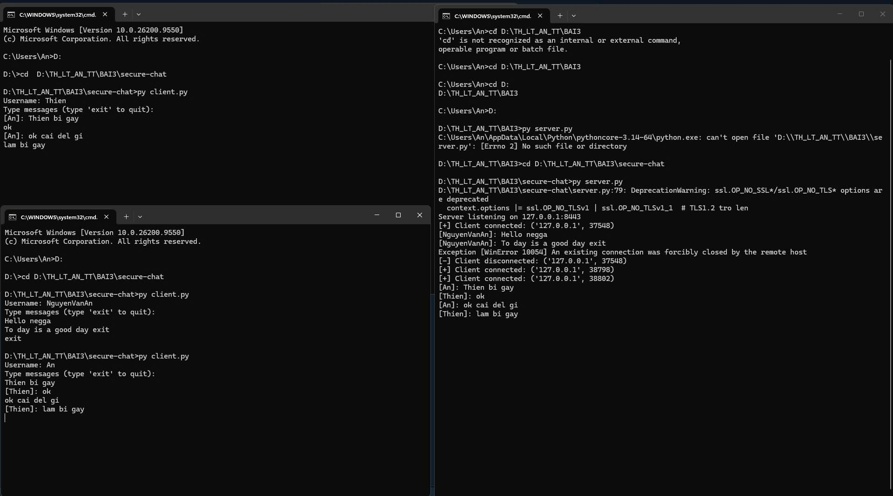

# LAB 1 - SecureChat (3.2 Thực hành: SecureChat)

Ứng dụng chat bảo mật chạy trên socket SSL/TLS: server đa luồng, client xác minh chứng chỉ (mutual TLS), tin nhắn được mã hóa thêm một lớp AES-256-CBC và hỗ trợ phòng chat.

## Cấu trúc

```
LAB_1/
├── openssl.cnf            # Cấu hình Root CA (v3_ca)
├── make-certs.bat         # Sinh CA, chứng chỉ server và client bằng OpenSSL
├── message_encryption.py  # MessageEncryption: AES-256-CBC + PKCS7, IV ngẫu nhiên
├── connection_manager.py  # ConnectionManager: quản lý client an toàn (có lock)
├── room_manager.py        # RoomManager: tạo / vào / rời / broadcast phòng chat
├── server.py              # SecureChatServer: SSL/TLS, yêu cầu chứng chỉ client
├── client.py              # SecureChatClient: xác minh chứng chỉ server bằng CA
└── requirements.txt
```

## Cài đặt và chạy

```bash
pip install -r requirements.txt
.\make-certs.bat        # tạo thư mục certs/ (đã được .gitignore)
py server.py            # terminal 1
py client.py            # terminal 2, 3, ... (nhập username rồi chat)
```

> Phải chạy các lệnh từ trong thư mục `LAB_1` vì đường dẫn chứng chỉ là đường dẫn tương đối (`certs/...`). Gõ `exit` để thoát client.

## Cách hoạt động

1. `make-certs.bat` tạo Root CA tự ký, sau đó dùng CA ký chứng chỉ cho server (`CN=localhost`) và client (`CN=client`).
2. Server dùng `ssl.CERT_REQUIRED` nên chỉ client có chứng chỉ do CA ký mới kết nối được; chặn TLS 1.0/1.1.
3. Client nạp `ca.crt` để xác minh chứng chỉ của server trước khi gửi dữ liệu.
4. Sau khi bắt tay TLS, client gửi `username:khóa AES (hex)`; server lưu khóa vào `ConnectionManager` và cho vào phòng `general`.
5. Mỗi tin nhắn được mã hóa AES bằng khóa của người gửi; server giải mã, rồi mã hóa lại bằng khóa riêng của từng người nhận trước khi chuyển tiếp.

## Kết quả

**Kiểm tra OpenSSL đã cài (`openssl version`, `openssl`)**



**Chạy `make-certs.bat` tạo chứng chỉ**



**Thư mục `certs` gồm `ca`, `client`, `server`**



**Chạy `server.py` và `client.py`** — server in tin nhắn đã giải mã của `NguyenVanAn`



**Thêm client thứ hai** — hai client nhắn tin qua lại, server nhận và chuyển tiếp



> Dòng `Exception [WinError 10054]` trên server xuất hiện khi client thoát (đóng kết nối đột ngột) nên không phải lỗi của chương trình. Cảnh báo `DeprecationWarning` về `OP_NO_TLSv1` cũng vô hại.
