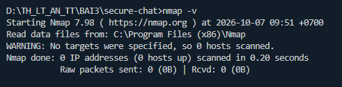
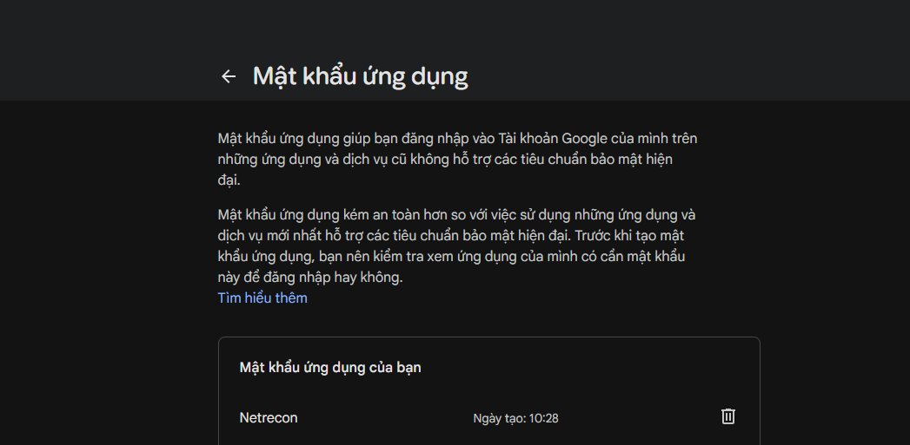
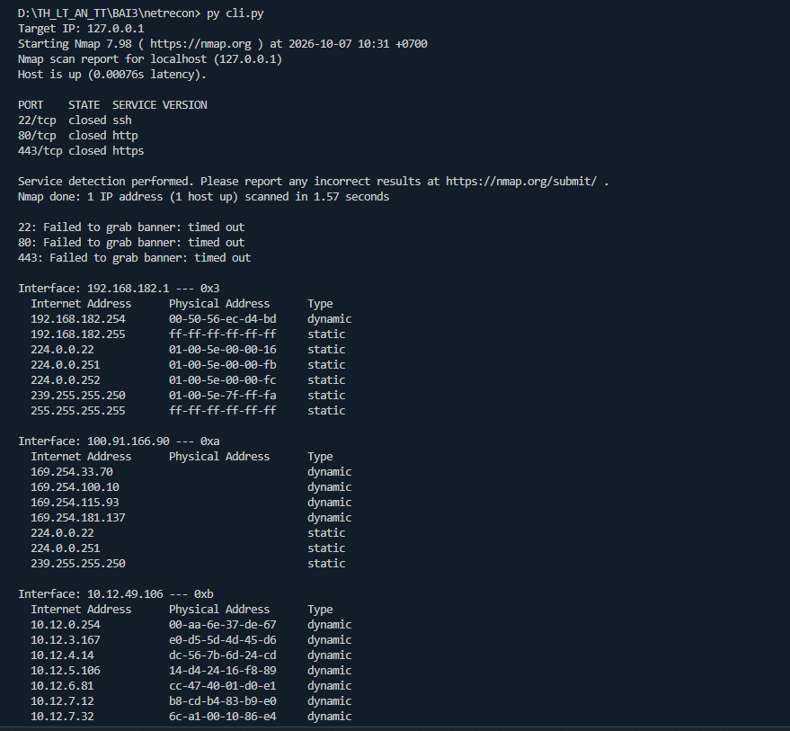
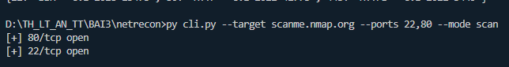
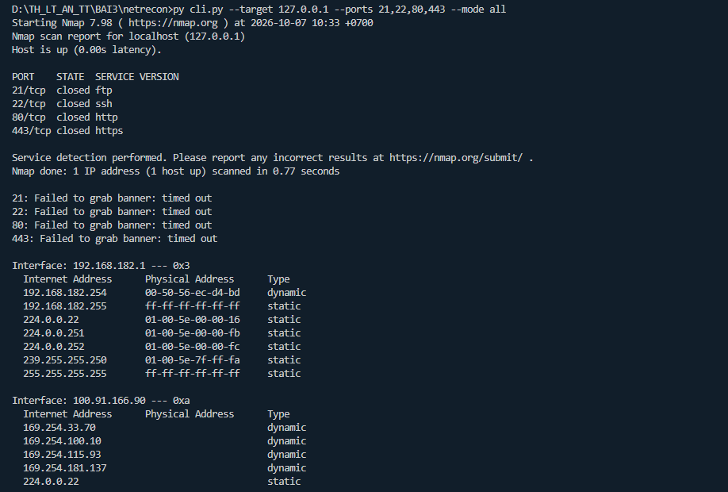
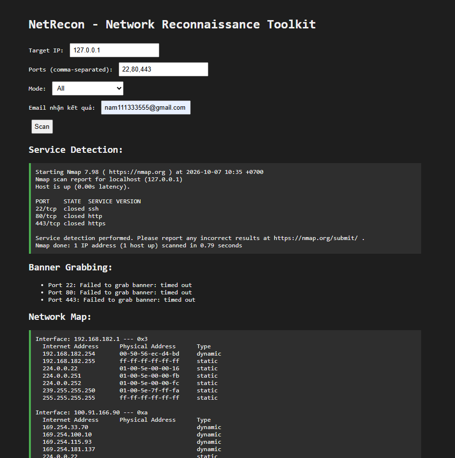
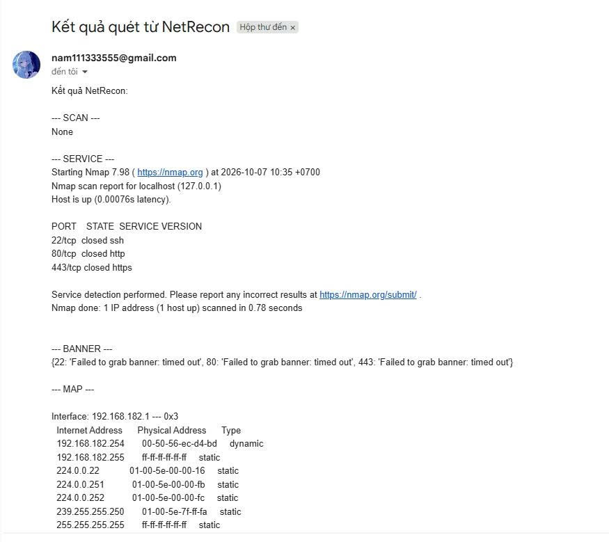

# LAB 2 - NetRecon (3.4 Thực hành: Network Reconnaissance Toolkit)

Bộ công cụ trinh sát mạng gồm quét cổng, nhận dạng dịch vụ, lấy banner, vẽ sơ đồ mạng (ARP) và kiểm tra lỗ hổng cơ bản. Dùng được qua dòng lệnh (`cli.py`) hoặc giao diện web Flask + HTMX (`app.py`), kết quả có thể gửi qua email.

## Cấu trúc

```
LAB_2/
├── cli.py                    # Giao diện dòng lệnh (click)
├── app.py                    # Giao diện web Flask (http://localhost:5000)
├── modules/
│   ├── port_scanner.py       # PortScanner: quét TCP bất đồng bộ, giới hạn tốc độ bằng Semaphore
│   ├── service_detector.py   # ServiceDetector: nmap -sV
│   ├── banner_grabber.py     # BannerGrabber: lấy banner qua socket, timeout 2s
│   ├── network_mapper.py     # NetworkMapper: đọc bảng ARP (arp -a)
│   ├── vuln_checker.py       # VulnChecker: đối chiếu cổng với CVE phổ biến
│   ├── filter_utils.py       # whitelist / blacklist mục tiêu
│   └── email_sender.py       # Gửi kết quả qua Gmail SMTP (SSL, cổng 465)
├── templates/                # layout.html, index.html, result.html
├── static/style.css
├── .env.example              # mẫu cấu hình SMTP
└── requirements.txt
```

Mọi hoạt động đều được ghi vào `netrecon.log` kèm thời gian (file này nằm trong `.gitignore`).

## Cài đặt

1. Cài [Nmap](https://nmap.org/download.html) và kiểm tra bằng `nmap -v`.
2. Tạo mật khẩu ứng dụng Gmail tại https://myaccount.google.com/apppasswords.
3. Sao chép `.env.example` thành `.env` rồi điền thông tin (file `.env` **không** được đưa lên Git):

```
SMTP_USER=your_email@gmail.com
SMTP_PASS=your_app_password
```

4. Cài thư viện:

```bash
pip install -r requirements.txt
```

## Sử dụng

```bash
# CLI
py cli.py --target 127.0.0.1 --ports 22,80,443 --mode all
py cli.py --target scanme.nmap.org --ports 22,80 --mode scan

# Web
py app.py     # rồi mở http://localhost:5000
```

Tham số CLI: `--target`, `--ports` (danh sách cách nhau bởi dấu phẩy), `--rate-limit` (số kết nối đồng thời, mặc định 100), `--mode` (`scan`, `service`, `banner`, `map`, `vuln`, `all`).

> Chỉ quét máy của mình hoặc hệ thống được cho phép (như `127.0.0.1`, `scanme.nmap.org`).

## Kết quả

**Cài Nmap thành công (`nmap -v`)**



**Tạo mật khẩu ứng dụng Gmail tên `Netrecon`**



**Chạy `cli.py` ở chế độ hỏi tương tác (mode `all`)** — nhận dạng dịch vụ, banner và bảng ARP



**Quét cổng `scanme.nmap.org` (`--mode scan`)** — tìm thấy cổng 22 và 80 đang mở



**Chế độ `all` với 4 cổng `21,22,80,443`**



**Giao diện web: nhập mục tiêu, cổng, chế độ và email rồi bấm Scan**



**Email kết quả nhận được từ hệ thống**



## Ghi chú

- Cổng `closed` trên `127.0.0.1` vì máy không chạy dịch vụ nào ở các cổng đó, nên banner báo `timed out`.
- Mục `SCAN` trong email là `None` vì `async_scan_ports` chỉ in cổng mở ra console và không trả về giá trị.
- Bảng cổng và CVE trong `vuln_checker.py` chỉ là danh sách tham khảo theo số cổng, không xác nhận máy đích thực sự có lỗ hổng.
